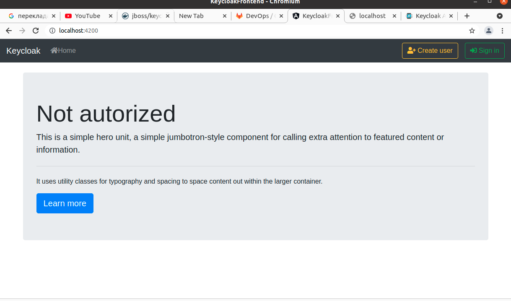

# keycloak_spring_angular

## Run keycloak

 `docker run -e KEYCLOAK_USER=admin -e KEYCLOAK_PASSWORD=admin -p 8180:8180 jboss/keycloak`
 
 import realm from file and create user from step "Tutor-Users:"
 or do all step "create realm tutor"
 run project keycloak-integration (copy) maven package>rename our jar in target to endp.jar 
 then run ` docker build -t endp .`
 
  `docker run --net=host -p 127.0.0.1:8888:8888 containerNumber`

run project keycloak-integration maven package>rename our jar in target to endp.jar
then run ` docker build -t foo .`

`docker run --net=host -p 127.0.0.1:8080:8080 containerNumber`

## create realm tutor

### Tutor:

create client tutor-back

client-tutor-back-settings set accessType - bearer-only  

client-tutor-back-roles addRole - backend-admin  

client-tutor-back-roles addRole - backend-user

### Tutor-Roles:

addRole realm-admin then -details -CompositeRoles-"on"  ClientRoles-chose-tutor-back add-"backend-admin"

addRole realm-user then -details -CompositeRoles-"on"  ClientRoles-chose-tutor-back add-"backend-user"

### Tutor-Users:

1)addUser admin set credentials pass: a

2)roleMappings add realm-admin, realm-user

addUser user set credentials pass: a

2)roleMappings add realm-user

### Tutor:

create client tutor-front

client-tutor-front-settings:

  accessType - public 
  
  set ValidRedirectURIs:http://localhost:4200/* 
  
  WebOrigins: *
  
client-tutorial-front-roles addRole - backend-admin  

client-tutorial-front-roles addRole - backend-user

### Build copy service

docker build -t endp .

docker build -t foo .

### Frontend

Go to angular keycloak-frontend folder, run console(terminal) , then run `npm install`, after `ng serve`.

Angular http://localhost:4200

### Steps

1. Navigate to welcom page

